# Mocktalk Backend

SwaggerUI: [https://api.mocktalk.site/swagger-ui/index.html](https://api.mocktalk.site/swagger-ui/index.html)

Mocktalk 커뮤니티 서비스의 백엔드 API 서버입니다.  
Spring Boot 기반으로 인증, 게시판, 댓글/대댓글, 알림, 파일 업로드 기능을 제공합니다.

## 한눈에 보기

- Base Path: `/api`
- 기본 포트: `8082` (`SERVER_PORT`)
- 관리 포트: `8083` (`MANAGEMENT_PORT`)
- 인증: JWT Access Token(Bearer) + Refresh Token(HttpOnly Cookie)
- DB 마이그레이션: Flyway (`src/main/resources/db/migration`)

## 기술 스택

- Java 21
- Spring Boot
- Spring Security 6
- Spring Data JPA
- QueryDSL
- PostgreSQL
- Redis
- Flyway

## 아키텍처

```text
Nginx
  ├─ /      -> Vue 정적 파일
  └─ /api   -> Spring Backend
               ├─ PostgreSQL
               └─ Redis
               └─ Object Storage(MinIO/OCI)
```

## ERD



## 도메인 구성

`src/main/java/com/mocktalkback/domain`

- `article`: 게시글
- `board`: 게시판/포럼
- `comment`: 댓글/대댓글
- `common`: 도메인 공통 타입/지원 모듈
- `file`: 파일 업로드
- `moderation`: 관리/제재
- `notification`: 알림
- `realtime`: 실시간 알림/연결 관리
- `role`: 권한
- `search`: 검색
- `user`: 회원/인증 연계

공통 모듈은 `global` 패키지(`auth`, `common`, `config`, `exception`)에 위치합니다.  
개발 전용 지원 코드는 `dev` 패키지에 위치합니다.

## 실행 방법

### 1) 환경 변수 준비

- 개발: `mocktalkback/.env.dev`
- 운영: `mocktalkback/.env.prod`
- 기본 키 목록: `mocktalkback/.env.example`
- 기본 `.env` 파일은 사용하지 않고, `.env.{profile}` 파일만 사용합니다.

개발/운영 프로파일 모두 동일한 키(`DB_*`, `REDIS_*`)를 사용하고 값만 다르게 관리합니다.
Spring Boot는 `.env.*` 파일을 자동 로딩하지 않으므로, 실행 전에 IDE/쉘/Docker에서 환경변수를 주입해야 합니다.

### 2) 애플리케이션 실행

Windows:

```powershell
.\scripts\dev-run.ps1
# 또는
.\scripts\dev-run.ps1 -EnvFile ".env.dev" -Profile "dev"
# 실행 실패 시 창 유지
.\scripts\dev-run.ps1 -KeepOpen
# 탐색기 우클릭 실행 대체(창 자동 종료 방지)
.\scripts\dev-run-open.cmd
```

macOS/Linux:

```bash
./scripts/dev-run.sh
# 또는
./scripts/dev-run.sh --env-file .env.dev --profile dev
```

### 3) 테스트/빌드

Windows:

```powershell
.\gradlew.bat test
.\gradlew.bat build
```

macOS/Linux:

```bash
./gradlew test
./gradlew build
```

DB/Redis/Object Storage는 사전에 실행되어 있어야 합니다.

로컬 개발에서 PostgreSQL/Redis/MinIO를 분리 실행하려면:

```powershell
docker compose -f docker-compose.postgres.yml up -d
docker compose -f docker-compose.redis.yml up -d
docker compose -f docker-compose.minio.yml up -d
```

## 프로파일

- `dev`: `application-dev.yml` 사용, 공통 DB/Redis 키(`DB_*`, `REDIS_*`)를 개발 값으로 사용
- `prod`: `application-prod.yml` 사용, 공통 DB/Redis 키(`DB_*`, `REDIS_*`)를 운영 값으로 사용

## 핵심 환경 변수

| 이름 | 설명 |
| --- | --- |
| `SPRING_PROFILES_ACTIVE` | 실행 프로파일 (`dev`, `prod`) |
| `SERVER_PORT` | API 서버 포트 |
| `MANAGEMENT_PORT` | Actuator 포트 |
| `JWT_SECRET` | JWT 서명 키 |
| `JWT_ISSUER` | JWT 발급자 |
| `DOMAIN` | OAuth2 리다이렉트 및 쿠키 정책 기준 도메인 |
| `SECURITY_ORIGIN_ALLOWLIST` | Refresh/Logout Origin 허용 목록 |
| `SECURITY_COOKIE_SECURE` | 쿠키 Secure 속성 사용 여부 |
| `OBJECT_STORAGE_ENDPOINT` | 오브젝트 스토리지 엔드포인트 |
| `OBJECT_STORAGE_REGION` | 오브젝트 스토리지 리전 |
| `OBJECT_STORAGE_BUCKET` | 버킷 이름 |
| `OBJECT_STORAGE_ACCESS_KEY` | 액세스 키 |
| `OBJECT_STORAGE_SECRET_KEY` | 시크릿 키 |
| `OBJECT_STORAGE_PATH_STYLE_ACCESS` | S3 호환 Path-Style 사용 여부 |
| `OBJECT_STORAGE_KEY_PREFIX` | 오브젝트 키 prefix |
| `OBJECT_STORAGE_PUBLIC_BASE_URL` | 퍼블릭 조회 URL 베이스(선택) |
| `OBJECT_STORAGE_PRESIGN_ENDPOINT` | Presigned URL 생성 기준 엔드포인트(선택) |
| `OBJECT_STORAGE_PRESIGN_EXPIRE_SECONDS` | Presigned URL 만료(초) |
| `OBJECT_STORAGE_UPLOAD_PROXY_PREFIX` | Presigned 업로드 URL 프록시 prefix(기본 `/storage`) |
| `UPLOAD_SESSION_TTL_SECONDS` | Presigned 업로드 세션 만료(초) |
| `UPLOAD_ORPHAN_CLEANUP_GRACE_SECONDS` | 업로드 세션 만료 후 고아 정리 유예 시간(초) |
| `UPLOAD_ORPHAN_CLEANUP_INTERVAL_MS` | Presigned 고아 파일 정리 스케줄 주기(ms) |
| `UPLOAD_ORPHAN_CLEANUP_BATCH_SIZE` | Presigned 고아 파일 정리 배치 크기 |
| `STORAGE_DELETE_RETRY_ENABLED` | 오브젝트 삭제 재시도 큐 활성화 여부 |
| `STORAGE_DELETE_RETRY_INTERVAL_MS` | 오브젝트 삭제 재시도 워커 주기(ms) |
| `STORAGE_DELETE_RETRY_BATCH_SIZE` | 오브젝트 삭제 재시도 처리 배치 크기 |
| `STORAGE_DELETE_RETRY_INITIAL_DELAY_SEC` | 삭제 재시도 초기 지연 시간(초) |
| `STORAGE_DELETE_RETRY_MAX_DELAY_SEC` | 삭제 재시도 최대 지연 시간(초) |
| `STORAGE_DELETE_RETRY_MAX_ATTEMPTS` | 삭제 재시도 최대 횟수 |
| `STORAGE_DELETE_DLQ_RETENTION_SEC` | 삭제 재시도 DLQ 보관 시간(초) |
| `APP_FILE_TEMP_EXPIRE_HOURS` | 임시 파일 만료 시간(시간) |
| `APP_FILE_TEMP_CLEANUP_INTERVAL_MS` | 임시 파일 정리 스케줄 주기(ms) |
| `DB_URL` | PostgreSQL 접속 URL(프로파일별 값만 다르게 관리) |
| `REDIS_HOST` | Redis 호스트(프로파일별 값만 다르게 관리) |

## API 문서(개발)

- `http://localhost:8082/swagger-ui/index.html`
- `http://localhost:8082/v3/api-docs`

## 패키지 구조

```text
com.mocktalkback/
├── dev/         # 개발용 시드/보조 코드
├── global/
│   ├── auth/
│   ├── common/
│   ├── config/
│   └── exception/
├── domain/
│   ├── user/
│   ├── article/
│   ├── board/
│   ├── comment/
│   ├── common/
│   ├── file/
│   ├── moderation/
│   ├── notification/
│   ├── realtime/
│   ├── role/
│   └── search/
└── infra/
    ├── redis/
    └── storage/
```

## 보안 정책 요약

- Access Token은 `Authorization: Bearer <token>`으로 전달합니다.
- Refresh Token은 HttpOnly Cookie로만 전달합니다.
- Refresh/Logout 같은 쿠키 기반 민감 엔드포인트는 Origin allowlist를 검사합니다.
- API는 Stateless를 기본 원칙으로 사용합니다.
