# Mocktalk Backend DB ERD (V1~V8)

이 문서는 `mocktalkback` 데이터베이스 스키마를 `V1`부터 `V8`까지 기준으로 정리한 ERD입니다.

- 기준 마이그레이션
  - `mocktalkback/src/main/resources/db/migration/V1__init.sql`
  - `mocktalkback/src/main/resources/db/migration/V2__seed_insert.sql` (시드 데이터, 구조 변경 없음)
  - `mocktalkback/src/main/resources/db/migration/V3__create_search_FTS.sql`
  - `mocktalkback/src/main/resources/db/migration/V4__search_rank_functions.sql` (함수 추가, 테이블 구조 변경 없음)
  - `mocktalkback/src/main/resources/db/migration/V5__moderation_admin.sql`
  - `mocktalkback/src/main/resources/db/migration/V6__file_variants.sql`
  - `mocktalkback/src/main/resources/db/migration/V7__article_sync_version.sql`
  - `mocktalkback/src/main/resources/db/migration/V8__security_advisor_fix.sql` (보안 설정, 테이블 구조 변경 없음)

## 버전별 구조 변경 요약

- `V1`: 기본 테이블/PK/FK/UNIQUE/인덱스 생성
- `V3`: 검색용 `search_vector` 컬럼 추가
  - `tb_boards`, `tb_articles`, `tb_comments`, `tb_users`
- `V5`: 운영/모더레이션 테이블 추가
  - `tb_reports`, `tb_sanctions`, `tb_admin_audit_logs`
- `V6`: 파일 파생본 테이블 및 파일 컬럼 추가
  - 테이블: `tb_file_variants`
  - 컬럼: `tb_files.metadata_preserved`, `tb_files.temp_expires_at`
- `V7`: 게시글 동기화 버전 컬럼 추가
  - `tb_articles.sync_version`
- `V8`: `fts_*` 함수 `search_path` 고정, `pg_trgm` 스키마 조정 (`extensions`)

## ERD (Mermaid)

```mermaid
erDiagram
    tb_role {
        BIGINT role_id PK
        VARCHAR role_name UK
        INT auth_bit
    }

    tb_users {
        BIGINT user_id PK
        BIGINT role_id FK
        VARCHAR login_id UK
        VARCHAR email UK
        VARCHAR handle UK
        TSVECTOR search_vector
        TIMESTAMPTZ deleted_at
    }

    tb_boards {
        BIGINT board_id PK
        VARCHAR board_name UK
        VARCHAR slug UK
        VARCHAR visibility
        TSVECTOR search_vector
        TIMESTAMPTZ deleted_at
    }

    tb_article_categories {
        BIGINT article_category_id PK
        BIGINT board_id FK
        VARCHAR category_name
    }

    tb_articles {
        BIGINT article_id PK
        BIGINT board_id FK
        BIGINT user_id FK
        BIGINT article_category_id FK
        VARCHAR visibility
        TSVECTOR search_vector
        BIGINT sync_version
        TIMESTAMPTZ deleted_at
    }

    tb_comments {
        BIGINT comment_id PK
        BIGINT user_id FK
        BIGINT article_id FK
        BIGINT parent_comment_id FK
        BIGINT root_comment_id FK
        INT depth
        TSVECTOR search_vector
        TIMESTAMPTZ deleted_at
    }

    tb_article_bookmarks {
        BIGINT article_bookmark_id PK
        BIGINT user_id FK
        BIGINT article_id FK
    }

    tb_article_reactions {
        BIGINT article_reaction_id PK
        BIGINT user_id FK
        BIGINT article_id FK
        SMALLINT reaction_type
    }

    tb_comment_reactions {
        BIGINT comment_reaction_id PK
        BIGINT user_id FK
        BIGINT comment_id FK
        SMALLINT reaction_type
    }

    tb_board_members {
        BIGINT board_manager_id PK
        BIGINT user_id FK
        BIGINT board_id FK
        BIGINT granted_by_user_id FK
        VARCHAR board_role
    }

    tb_board_subscribes {
        BIGINT board_subscribe_id PK
        BIGINT user_id FK
        BIGINT board_id FK
    }

    tb_notification {
        BIGINT notification_id PK
        BIGINT user_id FK
        BIGINT sender_id FK
        VARCHAR noti_type
        VARCHAR reference_type
        BIGINT reference_id
        BOOLEAN is_read
    }

    tb_file_classes {
        BIGINT file_class_id PK
        VARCHAR file_class_code
        VARCHAR media_kind
    }

    tb_files {
        BIGINT file_id PK
        BIGINT file_class_id FK
        VARCHAR storage_key UK
        BOOLEAN metadata_preserved
        TIMESTAMPTZ temp_expires_at
        TIMESTAMPTZ deleted_at
    }

    tb_file_variants {
        BIGINT variant_id PK
        BIGINT file_id FK
        VARCHAR variant_code
        VARCHAR storage_key UK
        INTEGER width
        INTEGER height
        TIMESTAMPTZ deleted_at
    }

    tb_article_files {
        BIGINT article_file_id PK
        BIGINT article_id FK
        BIGINT file_id FK
    }

    tb_comment_files {
        BIGINT comment_file_id PK
        BIGINT comment_id FK
        BIGINT file_id FK
    }

    tb_board_files {
        BIGINT board_file_id PK
        BIGINT board_id FK
        BIGINT file_id FK
    }

    tb_user_files {
        BIGINT user_file_id PK
        BIGINT user_id FK
        BIGINT file_id FK
    }

    tb_user_oauth_links {
        BIGINT user_oauth_link_id PK
        BIGINT user_id FK
        VARCHAR provider
        VARCHAR provider_id
    }

    tb_reports {
        BIGINT report_id PK
        BIGINT reporter_user_id FK
        BIGINT target_user_id FK
        BIGINT board_id FK
        BIGINT processed_by FK
        VARCHAR target_type
        BIGINT target_id
        VARCHAR status
    }

    tb_sanctions {
        BIGINT sanction_id PK
        BIGINT user_id FK
        BIGINT board_id FK
        BIGINT report_id FK
        BIGINT created_by FK
        BIGINT revoked_by FK
        VARCHAR scope_type
        VARCHAR sanction_type
    }

    tb_admin_audit_logs {
        BIGINT admin_log_id PK
        BIGINT actor_user_id FK
        BIGINT board_id FK
        VARCHAR action_type
        VARCHAR target_type
        BIGINT target_id
    }

    tb_role ||--o{ tb_users : role

    tb_users ||--o{ tb_articles : author
    tb_boards ||--o{ tb_articles : board
    tb_article_categories ||--o{ tb_articles : category

    tb_users ||--o{ tb_comments : author
    tb_articles ||--o{ tb_comments : article
    tb_comments ||--o{ tb_comments : parent
    tb_comments ||--o{ tb_comments : root

    tb_users ||--o{ tb_board_members : member
    tb_boards ||--o{ tb_board_members : board
    tb_users ||--o{ tb_board_members : granted_by

    tb_users ||--o{ tb_board_subscribes : subscriber
    tb_boards ||--o{ tb_board_subscribes : board

    tb_users ||--o{ tb_article_bookmarks : user
    tb_articles ||--o{ tb_article_bookmarks : article

    tb_users ||--o{ tb_article_reactions : user
    tb_articles ||--o{ tb_article_reactions : article

    tb_users ||--o{ tb_comment_reactions : user
    tb_comments ||--o{ tb_comment_reactions : comment

    tb_users ||--o{ tb_notification : receiver
    tb_users ||--o{ tb_notification : sender

    tb_file_classes ||--o{ tb_files : file_class
    tb_files ||--o{ tb_file_variants : variants

    tb_articles ||--o{ tb_article_files : article
    tb_files ||--o{ tb_article_files : file

    tb_comments ||--o{ tb_comment_files : comment
    tb_files ||--o{ tb_comment_files : file

    tb_boards ||--o{ tb_board_files : board
    tb_files ||--o{ tb_board_files : file

    tb_users ||--o{ tb_user_files : user
    tb_files ||--o{ tb_user_files : file

    tb_users ||--o{ tb_user_oauth_links : oauth

    tb_users ||--o{ tb_reports : reporter
    tb_users ||--o{ tb_reports : target_user
    tb_users ||--o{ tb_reports : processed_by
    tb_boards ||--o{ tb_reports : board

    tb_users ||--o{ tb_sanctions : target_user
    tb_users ||--o{ tb_sanctions : created_by
    tb_users ||--o{ tb_sanctions : revoked_by
    tb_boards ||--o{ tb_sanctions : board
    tb_reports ||--o{ tb_sanctions : report

    tb_users ||--o{ tb_admin_audit_logs : actor
    tb_boards ||--o{ tb_admin_audit_logs : board
```

## 핵심 UNIQUE 제약 요약

- 사용자: `login_id`, `email`, `handle`
- 게시판: `board_name`, `slug`
- 파일: `tb_files.storage_key`, `tb_file_variants.storage_key`
- 멤버/구독: `(user_id, board_id)`
- 북마크/반응: `(user_id, article_id)`, `(user_id, comment_id)`
- 카테고리: `(board_id, category_name)`
- OAuth: `(provider, provider_id)`, `(user_id, provider)`
- 파일 매핑: `(article_id, file_id)`, `(comment_id, file_id)`, `(board_id, file_id)`, `(user_id, file_id)`

## 참고

- `V8`은 Supabase Security Advisor 경고 완화 목적의 보안 조치입니다.
- ERD 관점에서 엔터티/관계 변경은 `V3`, `V5`, `V6`, `V7`에서 발생했습니다.
